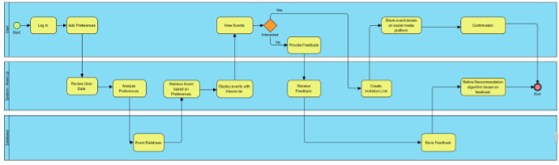
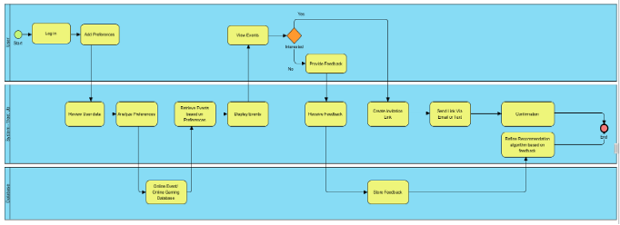
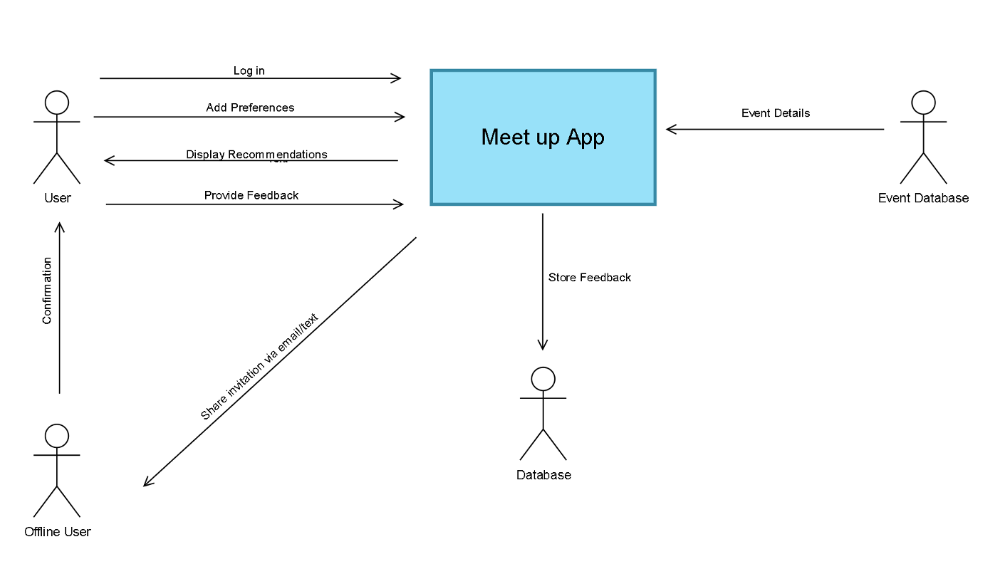
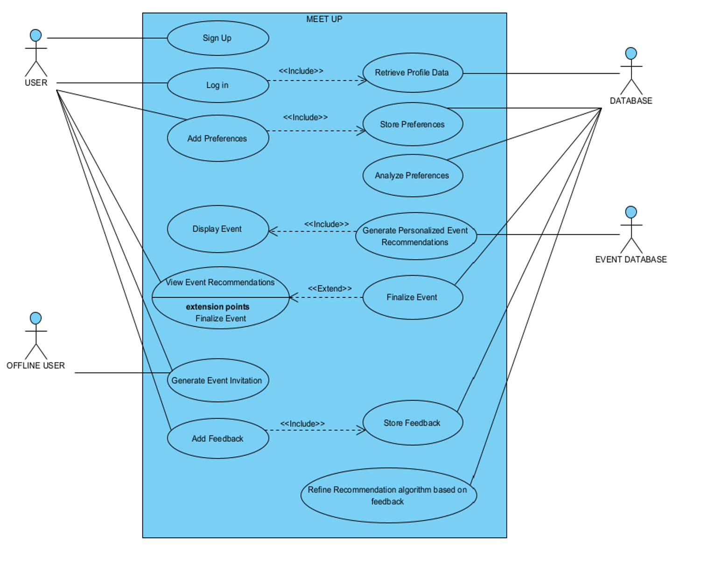
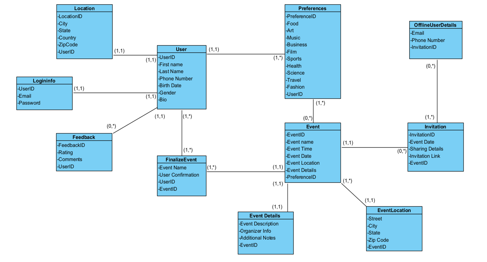
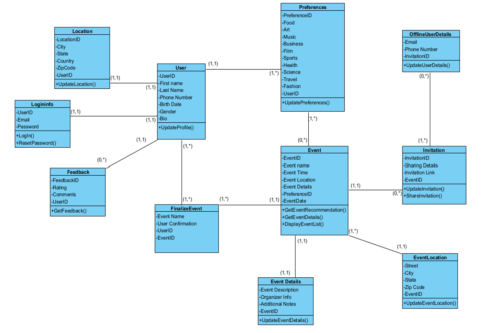
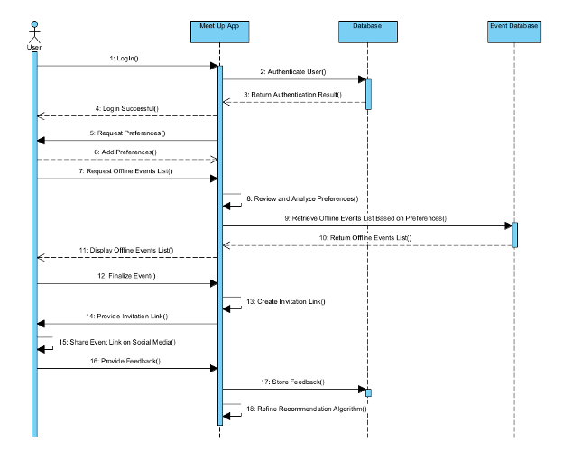
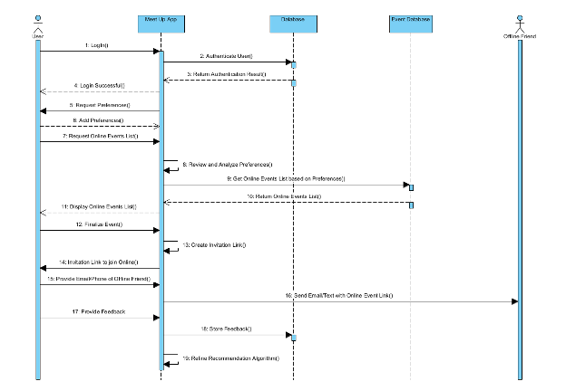
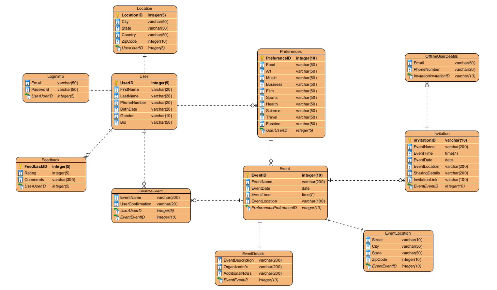

# MeetUp-Virtual-Physical-Integration

This project presents a conceptual system designed to bridge the divide between virtual and real-world social connections. It enhances the way individuals interact by enabling seamless transitions between online relationships and offline meetups, fostering deeper personal and professional engagement.

---

## 🚀 Project Overview

In the modern digital era, most individuals maintain separate online and offline social circles, leading to missed opportunities for building meaningful relationships. 

This project introduces an integrated platform that:

✅ Recommends offline events based on user interests and online activities  
✅ Allows users to invite online friends to real-world events  
✅ Enables users to invite offline friends to virtual events via SMS or Email  
✅ Collects feedback after events to refine future recommendations  
✅ Prioritizes data privacy and secure information management  

---

## 🎯 Objectives

- Seamlessly integrate virtual preferences with physical interactions  
- Provide event recommendations personalized to user profiles  
- Strengthen social bonds by promoting meaningful offline and online connections  
- Securely handle user data and continuously improve recommendations based on feedback  

---

## 🛠️ Key Features

- Personalized offline event suggestions  
- Ability to invite online friends/followers to in-person meetups  
- Invite offline friends to virtual activities using SMS or Email  
- Feedback collection for improving recommendation algorithms  
- User-friendly system design with emphasis on privacy and security  

---

## 📂 Project Structure

MeetUp-Virtual-Physical-Integration/
├── README.md
├── MeetUp_Project_Report.pdf
├── Diagrams/
├── Design/

---

## 🗂️ System Diagrams

Visual representations of the system's design and workflows are available in the `/Diagrams` folder:

- BPMN Diagrams – Offline & Online Event Processes  
- Context Diagram – System boundaries and interactions  
- Use Case Diagram – User-system interaction flows  
- Class Diagrams – System structure (With & Without Methods)  
- Sequence Diagrams – User interaction sequences  
- ER Diagram – Database structure  

## 🗂️ System Diagrams

### BPMN - Offline Event Process

### BPMN - Online Event Process

### Context Diagram

### Use Case Diagram

### Class Diagram (Without Methods)

### Class Diagram (With Methods)

### Sequence Diagram - Offline Interaction

### Sequence Diagram - Online Interaction

### Entity Relationship Diagram (ERD)

---

## 📐 System Design Documentation

The `/Design` folder includes:

- `Functional_Specifications.md` – System functionalities & user stories  
- `Class_Methods.md` – Method logic for each system class  
- `Database_Schema.sql` – SQL script defining database tables and relationships  
- `System_Constraints.md` – Database rules and constraints  
- `Sequence_Logic.md` – Event interaction process logic  

---

## 💻 Technologies & Tools

| Area               | Tools/Concepts                       |
|--------------------|--------------------------------------|
| Process Modeling   | BPMN, UML Diagrams                  |
| System Design      | Class, Use Case, Sequence Diagrams  |
| Database Design    | Relational Model, SQL Concepts      |
| Documentation      | Markdown, Technical Specifications  |

---

## 👨‍💻 My Role & Contributions

I individually designed and documented the system, including:

✔ Requirement analysis and solution conceptualization  
✔ BPMN and UML modeling for system design  
✔ Database design with ER modeling and constraints  
✔ Functional specifications and method logic development  
✔ End-to-end technical documentation  

---

## 📌 Project Status

✅ Academic project completed as part of System Analysis & Project Management coursework  
💡 Future work includes developing a working software prototype with frontend and backend integration  

---

## 🎯 Learning Outcomes

- Strengthened skills in system analysis, process modeling, and design thinking  
- Applied theoretical concepts to real-world technical solutions  
- Developed comprehensive documentation to communicate technical designs effectively  

---

## 📢 Acknowledgment

This project was developed to demonstrate system analysis and project management capabilities within an academic setting.

---

